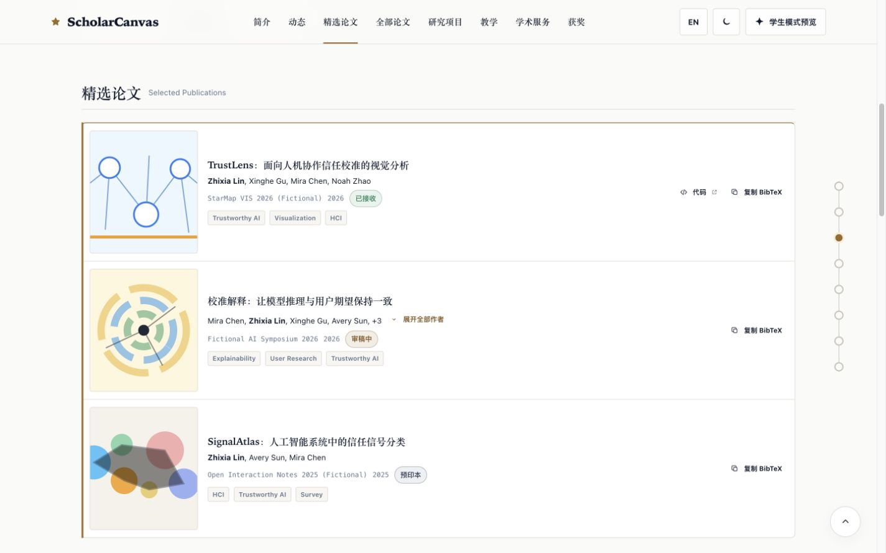
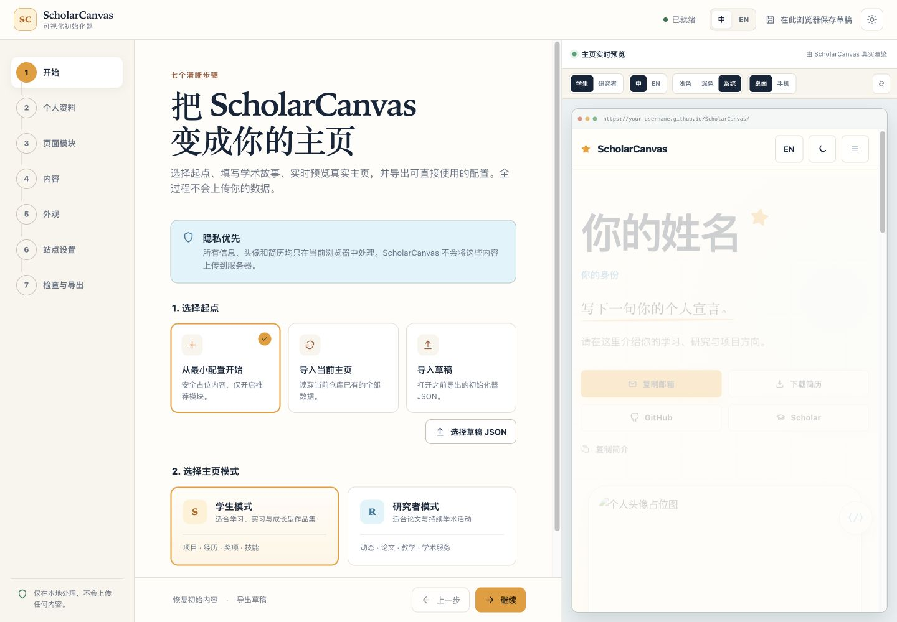
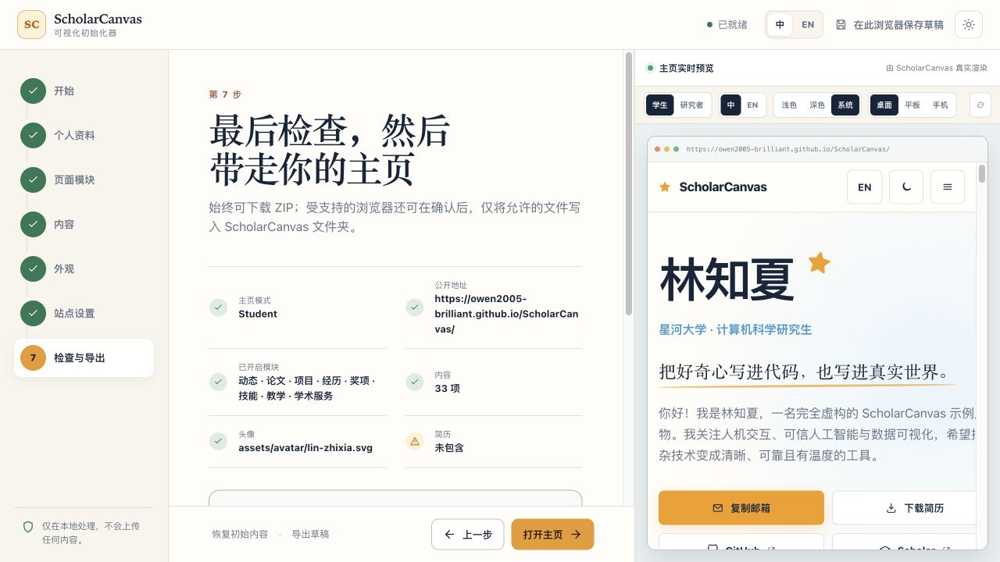

# ScholarCanvas

ScholarCanvas is a bilingual academic homepage for students and researchers, with dedicated Student and Researcher modes. It is fully static—no backend, database, dependency installation, or build step—and the recommended way to configure it is the visual setup page.

> The bundled people, institutions, publications, projects, and awards are fictional examples. Replace them before publishing.

[Live Demo](https://owen2005-brilliant.github.io/ScholarCanvas/) · [**Visual Setup**](https://owen2005-brilliant.github.io/ScholarCanvas/setup.html) · [Use this template](https://github.com/Owen2005-brilliant/ScholarCanvas/generate) · [中文 README](README.zh-CN.md)

## Online experience

- [View the ScholarCanvas demo](https://owen2005-brilliant.github.io/ScholarCanvas/)
- [Create your homepage with Visual Setup](https://owen2005-brilliant.github.io/ScholarCanvas/setup.html)
- [Read the Visual Setup guide](docs/visual-setup-guide.md)

Visual Setup runs entirely in your browser. Your profile, avatar, CV, and sharing image are not uploaded to a ScholarCanvas server.

## Quick start

1. Choose **Use this template** on GitHub to create your own repository.
2. Open [Visual Setup](https://owen2005-brilliant.github.io/ScholarCanvas/setup.html).
3. Choose Student or Researcher, then enter your profile, projects, publications, and experience.
4. Check the live preview and download the generated configuration bundle.
5. Download or clone your ScholarCanvas repository, unzip the bundle, and copy its files over the matching paths in your repository.
6. Check that `index.html` shows your information, then push the changes to GitHub.
7. Open **Settings → Pages → Source → GitHub Actions** in your repository.
8. Wait for deployment, then visit your personal homepage.

Students without publications can leave the Publications section turned off. You do not need to edit JavaScript to complete this workflow.

<details>
<summary>Use Visual Setup locally</summary>

After downloading or cloning your repository, you can double-click `setup.html`. For a local server, run this command from the repository folder:

```bash
python3 -m http.server 8000
```

Then open [http://localhost:8000/setup.html](http://localhost:8000/setup.html). No Node.js, backend, database, package install, or build command is required.

</details>

## Preview

### Student Mode


### Researcher Mode



### Visual Setup



<details>
<summary>More screenshots</summary>




</details>

[Read about the visual design process](docs/setup-visual-spec.md).

## Student and Researcher modes

| | Student | Researcher |
| --- | --- | --- |
| Best for | Students, applicants, and early-stage researchers | Graduate researchers, faculty, and research staff |
| Content priority | Projects, interests, and experience | News, publications, teaching, and service |
| Recommended sections | Projects, Experience, Awards, Skills | News, Publications, Projects, Teaching, Service |
| Visual style | Warm, open, and project-led | Compact, structured, and publication-led |

You can preview both modes without deleting content, then publish the one that best fits your homepage.

## Features

- Student and Researcher homepage modes
- Instant Chinese and English switching
- Light, dark, and system themes
- Seven-step visual configuration
- Live homepage preview
- Editors for projects, publications, experience, and other sections
- Local avatar, CV, and sharing-cover handling
- Browser-local drafts and configuration ZIP export
- GitHub Pages deployment with no build step
- Keyboard accessibility, reduced motion, and responsive mobile layouts

## Deploy with GitHub Pages

1. Push the configured repository to GitHub using `main` as the publishing branch.
2. Open **Settings → Pages**.
3. Set **Source** to **GitHub Actions**.
4. Wait for the Validate and Deploy workflows to finish, then open the Pages URL shown by GitHub.

ScholarCanvas is a static site and can also be placed on other static hosting services without a build command.

## Advanced use

Visual Setup is the recommended workflow. The generated content is stored in `data/*.js`; if you need manual editing, batch updates, or secondary development, read the [manual configuration guide](docs/manual-configuration.md).

Development, testing, and contribution instructions are in [CONTRIBUTING.md](CONTRIBUTING.md).

## Contributing and license

Please read [CONTRIBUTING.md](CONTRIBUTING.md), [CODE_OF_CONDUCT.md](CODE_OF_CONDUCT.md), and [SECURITY.md](SECURITY.md) before contributing. ScholarCanvas is available under the [MIT License](LICENSE).

© 2026 ScholarCanvas contributors.
